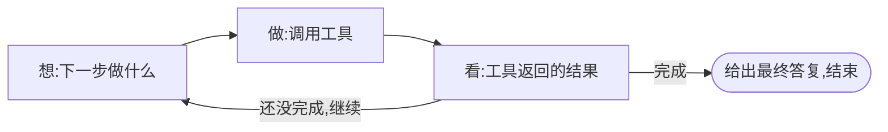
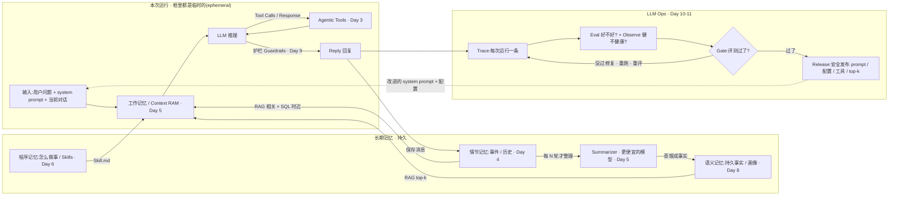

# Chapter 00 · 基础全景:模型、工具、循环

动手写 agent 之前，先把地基打全。这一章不写代码，约 15~20 分钟，建立六个概念——
后面每一章都建在它们之上。读完你会知道:LLM 到底是什么、怎么"读"和"想"、"对话"在代码里长什么样、
工具怎么接进来、以及 agent 到底是什么。

---

## 一、LLM 是什么，不是什么

大语言模型(LLM)的本质，一句话:**一个极强的"下一个词预测器"**。给它一段文字，它根据海量训练，预测**接下来最可能出现的文字**，一个 token 一个 token 地吐出来。

就这么简单。由此推出它的能力和边界:

- ✅ 它"知道"很多——因为训练时读了海量文本。
- ❌ 但它的知识**冻结在训练截止那一刻**(cutoff)，问它之后的事只能瞎编。
- ❌ 它**不能改变世界**:读不了你的文件、跑不了命令、发不了请求。它只会**产出文字**。
- ⚠️ 它是**概率性**的:同样的输入，输出可能不同;它可能自信地说错(幻觉)。

**记住这两条边界(不知新事、不能行动)，整门课都在想办法突破它们**——用工具让它能行动(本章后面)，用外部数据让它知道新事(后面章节)。

## 二、模型怎么"读":token 与上下文窗口

模型不是按字/词处理文字，而是按 **token**(词元)——一段文字被切成一串 token(一个英文词可能是 1 个 token，一个汉字可能是 1~2 个)。**模型的一切输入输出都是 token。**

模型一次能"看到"的 token 有上限，叫**上下文窗口(context window)**——比如 20 万或 100 万 token。这个窗口装下**本次请求的全部**:你的指令 + 历史对话 + 它要生成的回复。

**为什么现在就要知道这个:** 一段长对话会不断变长，迟早撑爆窗口。所以后面有一整章(Day 5)专门讲**怎么在窗口预算内管理上下文**。你现在只要记住:**上下文是有限的、要花着用的资源。**

## 三、模型怎么"想":思维链与推理

一个反直觉但关键的事实:**让模型"先一步步想，再给答案"，它在复杂问题上会答得明显更好。** 这叫**思维链(chain-of-thought)**——因为它是"续写文字"的机器，先写出推理步骤，后面的答案就建立在这些步骤上，而不是一步蒙对。

- 早期靠提示词触发("让我们一步步想……")。
- 现在的**推理模型(reasoning models)**内置了这个:回答前先产出一段"思考"，再给正式答复(Anthropic 叫 extended thinking)。

**这不是魔法，就是"先生成中间推理文本"。** 对 agent 尤其重要:模型要**边做边判断**下一步调什么工具，这种判断就依赖它的推理能力。后面章节接真实模型时会再遇到它。

到 2026,这类**推理模型已是前沿默认**。但记住一条:"想"本身也是在生成 token——**想得越多越准,也越慢越贵**。所以它是个**旋钮**(要不要开、开多深，看任务),不是永远打开的免费开关。这又是本课那句克制的另一面:不是越"能想"越好。

## 四、"对话"其实是一个消息列表

你在 ChatGPT 里看到的"聊天"，在代码里不是什么神奇的会话状态，而是**一个不断增长的消息数组**。每条消息有个**角色(role)**:

- `system`:给模型的总纲/人设/规则(可选，通常放最前)。
- `user`:用户说的话。
- `assistant`:模型说的话。

**关键:API 是无状态的。** 模型不会"记得"上一轮——是**你每次请求都把整个消息列表重新发过去**，它才有上下文。所谓"多轮对话"，就是这个数组越来越长、每轮整个发。

> 这直接接上 Day 1:你会看到一个 `history` 数组，里面每条带 `role`——那就是这个消息列表，只是我们的角色分得更细(user / 模型提议 / 工具结果 / 最终答复)，好把"工具"这件事表达清楚。

## 五、工具 / function calling:让只会说话的模型"能行动"

模型只会产出文字，那它怎么"读文件"?靠**工具(tool)**，也叫 **function calling**:

1. 你(开发者)准备一些**函数**(读文件、查数据库……)，把它们的**说明书**(名字、干嘛、要什么参数)告诉模型。
2. 模型需要时，不是自己执行，而是**产出一段结构化的"我想调用 read，参数是 X"**——本质还是"生成文字"，只不过是机器能解析的格式。
3. **你的代码**接住这个请求，**真去执行**那个函数，把结果**发回**给模型。
4. 模型拿到结果，继续。

看出来了吗——**模型只负责"决定调什么"(提议)，真正"执行"的是你的代码。** 这个分工是下一章(Day 1)的全部核心。function calling 就是给"小黑屋里的大脑"装上手脚的标准方式。

## 六、把它们合起来:什么是 agent

**agent = 一个 LLM + 一组工具 + 一个让它反复"想→做→看结果"的循环。**

一个具体画面——你对 coding agent 说"这个测试为啥挂了，修好它":

这个"想→做→看→再想"转圈，就是 agent 的本质;它比裸模型强，是因为能**根据真实反馈纠正自己**，而不是一次性瞎猜。**这个循环，就是 Day 1 你要亲手写的东西。**

### 但别滥用 agent(重要)

主流共识(尤其 Anthropic《Building effective agents》):**能用简单方案就别上 agent。**

- 一步说得清、结果可预测(翻译、抽字段)→ **一次模型调用**就够，别 agent。
- 步骤固定写死(先 A 再 B 再 C)→ 用**写死的工作流**，别让模型自己决定步骤。
- 只有**开放、多步、事先无法把步骤写死、要模型边做边判断**时 → 才用 agent。

agent 更强，但更慢、更贵、更难预测。**判断"该不该上 agent"，本身就是这门课要给你的能力之一。**

---

## 七、主线:agent 是怎么"进化"来的(raw → harness → loop → graph)

这门课不是零散知识点，而是**沿着 agent 架构的真实进化史一路建上去**。记住这四格，你就知道每天在往哪走:

| 阶段 | 是什么 | 局限 → 催生下一格 |
|------|--------|-------------------|
| **raw** 裸调用 | 直接"一问一答"，无工具、无记忆 | 不知新事、不能行动、一步定生死 |
| **harness** 脚手架 | 在模型外包一层代码:结构化消息、解析、手工接一次工具 | 步骤写死，不能自主决定下一步 |
| **loop** 循环 | 模型自主"想→做→看→再想"，反复用工具 —— **agent 诞生** | 单 agent、线性;复杂协作/分支/可恢复难表达 |
| **graph** 编排 | 把多步/多 agent 组织成显式的图:分支、并行、可暂停恢复、多 agent 协作 | 当前前沿;**按需用，别过度** |

**关键判断力:不是越靠右越好。** 能 raw 就别 harness，能单 loop 就别 graph——和"能一次调用就别上 agent"同一种克制。你会在 Day 1 建 loop、Day 2 补 raw→harness、Day 7 走到 graph。(完整设计见 [`CURRICULUM.md`](../../CURRICULUM.md)。)

### 另一条轴:一次请求怎么流过 harness(全课总览)

上面是**时间轴**(agent 怎么进化来的)。换个视角看**数据流轴**——一次请求跑起来,数据怎么流过各层。下面这张图几乎就是**整门课的索引**:每个方块都对应后面某一天。**现在只需扫一眼有个全景**,不必看懂细节(图可点开放大)。

分三块读(每块对应后面的章):

- **本次运行(临时)**:`输入 → 工作记忆 → LLM ⇄ 工具(loop)→ 护栏 → Reply`。关键一句:**运行框里的一切都是临时的(ephemeral)——跑完即弃**。工作记忆就是那块"有限、要花着用"的 Context RAM(Day 5)。
- **长期记忆(持久)+ 整理**:三种记忆各按不同方式被取回喂进工作记忆——**程序记忆**(怎么做事 / Skills,Day 6)、**语义记忆**(持久事实 / 用户画像,RAG 语义检索,Day 8)、**情节记忆**(带时间的事件 / 历史,语义 + SQL 时近,Day 4)。Reply 先存进情节记忆;**每 N 轮**才用一个**更便宜的 summarizer 模型**把它蒸馏成语义事实(这就是 Day 5 的 compaction——不必每轮都整理)。
- **LLM Ops(闭环)**:`Reply → Trace → Eval / Observe → Gate`。**没过**就修复、重跑、重评;**过了**才 Release(安全发布新 prompt / 配置 / 工具 / top-k),再把**改进的 prompt + 配置回流**进输入(Day 10–11)。

**围住模型的这一整套(输入准备 + 记忆 + loop + 运营反馈),就叫 harness。** 注意那**两条反馈边**——经验**写回记忆**、Ops **回流配置**——正是它们让系统从"直线管道"变成会**自我改进的活系统**(呼应后面 Day 10 的 Trace → Memory → Skill、"自进化发生在模型周围的 harness,而非模型本身")。模型决定一次推理多聪明,**harness 决定这份聪明怎么变成连续、可靠、能积累的真实工作——这门课建的就是这一整圈**。

---

## 八、这门课带你去哪

完整路线(每天建什么)见项目根的 `README.md` / `CURRICULUM.md`——**顺序与导航只在那里维护，章节内容不重复"第几天"**(这样重排章节时只改一处)。

核心不是"学会调某个 API"，而是:**每一块你都先能自己做出来，于是将来 AI 替你写这些时，你看得懂、也纠得动。**

---

## 九、进下一章之前，先想一个(写进 [`JOURNAL.md`](../../JOURNAL.md))

不用写代码。就回答:

> 第六节那个 coding agent 修 bug 的例子里——"运行测试""读文件""编辑文件"这三个"做"的动作，
> 到底是**模型**亲自完成的，还是**另有其人**?(结合第五节想想)

凭现在的理解答。带着这个猜测进下一章(Agent Loop)，那一章会给你答案，并让你亲手把它建出来。
