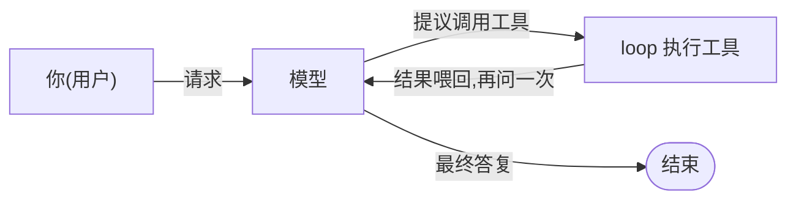
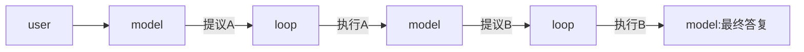

# Chapter 01 · Agent Loop:模型 · 工具 · 循环

> 目标:亲手写出 agent 的核心循环——能处理连续调用、一步多个调用、工具出错、防止跑飞。
> (本章聚焦 **loop 本身**，用一个假模型;把它接到**真实模型**是 Day 2。)

读这一章:先把下面的**完整图景**读透(背景知识全在这，不留洞)，再动手写 `runAgent`(练习，答案留给你自己推)。

---

## 一、完整图景:agent 是怎么运转的

大语言模型(LLM)本身只会一件事:**给它文字，它接着写文字。** 它读不了文件、跑不了命令、上不了网——一个被关在小黑屋里的大脑，只能想和说。

让它真能"帮你干活"，靠**三方协作**:



- **你(开发者)**:提出请求;事先准备一批**工具**(函数)，把它们的**说明书**告诉模型。
- **模型**:知道有哪些工具后，**决定**用哪个、**提议**一次调用——但**只提议，从不执行**。
- **loop(你写的代码)**:接住提议，**真去执行**，把结果**喂回**模型，再问下一步;往复到模型给出最终答复。

**本章支点(记牢这一句，后面全靠它推):**

> ★ 模型只会看 history 说话、只会"提议";真去执行、把结果喂回、决定何时停，都是 loop 的事。★

这条对任何 provider 都成立——它就是所有 agent(ChatGPT 插件、Claude Code、Cursor)的内核。

> **为什么亲手写?** 以后框架(Vercel AI SDK 等)会替你把 loop 写好、藏起来。正因为你亲手写过，才看得懂框架替你做了什么、出问题时才改得动。**先从零建，再用框架。**

---

## 二、由浅入深:从一个工具，到一个完整循环

### 1. 一个"工具"就是一个函数

工具不神秘，就是个普通函数:给参数，返回字符串。

```ts
const read = (args: { path: string }) => `文件 ${args.path} 的内容……`;
```

把可用工具收进一张**注册表**(名字 → 函数)，它就是"这个 agent 能做哪些事"的全集:

```ts
const tools = { read /*, add, search, ... 任意多个 */ };
```

注册表里**只有"名字 → 函数"，没有别的**(记住这点，下面配对时有用)。

### 2. 让模型"知道"有这些工具

模型看不见你的函数体。每次请求，你把工具的**说明书(schema:名字+干嘛+参数)**连同对话发给模型，模型据此**按名字**挑一个来调。

> **本章简化了什么:** 为聚焦 loop，我们用一个**脚本假模型**(见 `agent.test.ts`)替代真实模型，所以"把说明书传给模型、模型据此生成调用"这一层被跳过了——假模型直接吐出写好的调用。**这一层真实存在**，留到后面 provider 章节实建。现在只要记得:模型是"被告知工具后才提议"的，不是凭空变出来。

### 3. 单次调用:一个完整来回

跑一下看轨迹:`npm run demo:01`

```
① user           读 README 并概括                      ← 你的请求
② model(提议)    调用 read, args={path:"README"}, id=c1 ← 模型只提议
③ loop(执行)     read 返回 "本项目是一门 agent 课程…"(配 id=c1) ← 你的代码真去执行
④ model(最终)    这是一门教你从零构建 agent 的课程。       ← 模型看到结果后收尾
```

三个关键概念，全在这四步里:

- **提议 ≠ 执行**:②是模型"说"要调 read;③才是你的 loop"真"去调。中间隔着你的代码。
- **id 配对**:模型在②提议时给这次调用生成编号 `c1`;③回填结果**必须带同一个 `c1`**，模型才认得出"这是我那次请求的结果"。**这个 id 由模型生成**(真实 API 里就是 Anthropic 的 `tool_use.id`、OpenAI 的 `tool_calls[].id`)，不在工具注册表里——注册表只有名字→函数。
- **喂回再问**:③之后没结束——结果喂回，模型被**再问一次**(④)才收尾。

### 4. 连续调用:为什么必须是"循环"

真实任务常常一次不够:模型先 `read` A、看完再决定 `read` B、最后才收尾。轨迹变成:



模型被问了 **3 次**，工具跑了 **2 次**。**关键:"要调几次"事先不知道**——所以你不能写死几步，必须用一个**循环**:问一步 → 若是 final 就停 → 若是 tool-calls 就执行、喂回、再问。这就是为什么 agent 的核心是 loop，而不是写死的流水线。

### 5. 一步多个调用(并发)

模型有时在**一步里**就提议多个调用(`step.calls` 是个数组，可能不止一个):"同时读 A 和 B"。你的 loop 要**对每个 call 都执行、都把结果按各自的 id 配回**，然后再问模型。别只处理第一个。

### 6. 工具出错:把失败当"数据"，不是当"崩溃"

工具会失败——文件不存在、网络超时、参数非法。**关键设计:工具抛异常时，不该让整个 loop 崩掉**，而应该**接住它**，把失败也变成一条 `tool-result`(标记 `isError: true`、把错误信息放进 text)**喂回给模型**。

为什么?因为对 agent 来说，**"工具失败"是模型可以观察、并据此调整的环境事实**——模型看到"文件不存在"，可能换个路径重试或换个方法。如果异常直接炸穿 loop，模型根本没机会应对。**环境失败是数据，不是程序 bug。**

### 7. 防跑飞:maxSteps

万一模型永远只返 tool-calls、从不 final(逻辑错误或恶意输入)，你的 loop 会**无限循环**。所以要有个**步数上限 `maxSteps`**:问模型的次数到达上限就**安全停下**，并如实报告停止原因(`stoppedReason: "max-steps"`)。

> 注意:`maxSteps` 限制的是**模型回合数**，不是工具个数，也不是墙钟时间。

---

## 三、你要建的:`runAgent`(练习)

背景全给了。现在把它变成代码——一个能扛上面**全部**情况(单次/连续/并发/异常/防跑飞)的 loop。

打开 `agent.ts`:类型已备好，你只写底部的 `runAgent`。它**不给现成算法**——`runAgent` 上方有 6 个问题(控制流/顺序/配对/一步多个/异常/防跑飞)，回答它们，答案连起来就是你的 loop。

**下手法(别一次写完):**

1. 先读 `agent.test.ts`——5 个测试由易到难，就是精确规格。
2. 从最简单的 **"无工具"** 起，只写让它变绿的最少代码。
3. `npm run test:01` → 让红色一个个牵着你补:单次 → 并发 → 异常 → maxSteps。

卡住:告诉 tutor「我试了 X、卡在 Y」，按 `定位→签名→伪代码→局部` 逐级要提示——别直接要答案。

---

## 四、收尾

- **讲回来**(测试全绿后，写进 [`JOURNAL.md`](../../JOURNAL.md)，讲不清=没真懂):
  ① 为什么执行工具必须是 loop、不是模型?
  ② 为什么工具异常要"当数据喂回"，而不是让 loop 崩?
  ③ `maxSteps` 为什么限制的是模型回合数，而不是工具个数?
- **迁移题**:见 [`TRANSFER.md`](./TRANSFER.md)——超出本章的进阶(取消/中断、流式、子 agent)。
- **真检验**:过几天删掉你的 `runAgent`，不看提示从空白再推一遍。推得出，才算学会。
