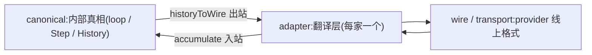

# Chapter 02 · 接真实模型 & 可靠输出(raw → harness)

> 目标:造一个"翻译层"(provider adapter)，让 Day 1 的 `runAgent` **一行不改**就能驱动真实模型;并掌握工程上从模型"可靠拿到东西"的三件必备:**真流式累积、结构化返回、错误归一**。走完演进前两格:**raw 裸调用 → harness 脚手架**。

Day 1 用假模型验证了 loop。今天接真实模型——而且要接得"干净、可靠":核心永不认识某一家 provider，且能扛住真实模型的流式、脏数据、报错。

---

## 一、raw → harness

最原始一格是 **raw**:`prompt → 文本`，一问一答，没工具/记忆/循环——局限你在 Day 0 已知(不知新事、不能行动、一步定生死)。

要让它可用，得在模型外包一层 **harness(脚手架)**:结构化消息、解析输出、处理流式/错误/结构化返回。Day 1 的 `runAgent` 已是一种 harness(编排 loop);今天补它**最靠近 provider 的那块:adapter**。

## 二、核心:provider adapter 与"内部真相"

> ★ 核心(loop、canonical 类型)永远不认识任何 provider;provider 的脏细节全部止步于 adapter。★

| 层 | 是什么 | 谁易变 |
|----|--------|--------|
| **canonical**(Day 1 的 Step/HistoryEntry) | 内部真相，你所有代码都用它 | 稳定，你定 |
| **adapter** | 翻译:canonical ⇄ 某家 wire 格式 | 每家一个 |
| **wire / transport** | provider 的线上格式 + 真正发请求 | 各家不同 |

换 provider = **只换 adapter/transport**,loop 与 canonical 类型**一行不动**。私有能力(如 prompt caching)藏在 adapter 接缝后按需用——这就是"不锁定"的落地。



**出站**:`historyToWire` 把 canonical history + 工具映射成 wire 请求(Lab 2.1)。

### 延伸:多模态——消息不止文本(canonical 的自然泛化)

到这里 canonical 消息还是"一段文本"。但真实模型早已多模态:一条 user 消息可以同时带**文字 + 图片**(截图、文档、图表),甚至音频。别慌——这**不是新架构**,只是 canonical IR 的**一处泛化**:

- **content 从"字符串"变成"parts 数组"**:`[{type:"text",...},{type:"image",...}]`。你的 loop、`accumulate`、`runAgent` **一行不动**——它们只搬运消息,不关心 part 里装的是字还是图。
- **adapter 多一种映射**:把 image part 翻成各家 provider 的线上格式(有的用图片 URL、有的用 base64 + mime,字段名各不同——**以各自官方文档为准,别凭记忆**)。这正是上面那张 `canonical ⇄ adapter ⇄ wire` 图的兑现:换一家,还是只动 adapter。
- provider 中立视角:Vercel AI SDK 已把"消息带 image part"抽象成统一形态,你只在 adapter 接缝处对接——和"不锁定"一脉相承。

**判断力(老规矩):能纯文本解决就别塞图。** 图片 token 更贵、更慢、也更容易让模型跑偏;只有任务**本质上是视觉的**(读截图、看图表、OCR-free 文档理解)才上。

> **Computer Use = loop + 一个视觉工具**:截图 → 模型看图决定点哪 → 执行 → 再截图。它不是新范式,而是 Day 1 的 loop + Day 3 的一个"截图/操作"工具 + 这里的 image part。Day 3 的迁移题已让你想过这件事。

## 三、真流式:参数是碎片拼出来的(本章硬骨头)

玩具教程里模型"整块"返回;**真实 provider 是逐段流式**吐回的，尤其:

- 工具调用的**参数是一串 JSON 碎片**(`{"pa` → `th":"REA` → `DME"}`)，要**攒齐才 `JSON.parse`**——对半截碎片 parse 必炸。
- 模型**一次并发多个调用**时，各调用的碎片**按 index 交错**到达，必须**按 index 分桶**累积，用一个 buffer 会串台。

`accumulate`(Lab 2.2)就是把这些碎片，还原成 Day 1 loop 只认识的一个 `Step`。写对它，你就掌握了"流式的碎片 → 完整语义事件"这个真实世界天天用的还原。`makeModel`(Lab 2.3)再把 transport 包成 Day 1 的 `Model`,loop 直接驱动。

## 四、结构化返回(工程必备)

agent 应用天天要**让模型返回符合 schema 的数据**(抽字段、分类、可靠解析)，而不是吐自由文本你再瞎 parse。

`generateObject`(Lab 2.4):发一个要 JSON 的 prompt → 累积文本 → `JSON.parse` → 用调用者给的 `validate` 校验成类型化 `T`;**解析/校验失败就抛清晰错误**(工程上宁可显式失败，绝不把脏数据往下传)。

> 结构化返回和 tool calling 是一回事的两面:都是"把模型输出约束成结构"。tool call 是结构化的**动作**,structured output 是结构化的**最终数据**。真实项目里 `validate` 通常用 Zod;本章用一个纯函数，保持 provider 中立。

### 延伸:2026 的原生结构化输出(约束解码)

上面 `generateObject` 走的是"**提示要 JSON → 累积 → parse → validate → 失败即报错**"这套**可移植兜底路**——好处是**任何 provider 都能用**,而且 `validate` + fail-closed 永远该留作安全网。但现代 API 有更硬的一招:

- **结构化输出 / 约束解码(constrained decoding)**:你把 **JSON Schema 一起传给 API**,它在**每生成一个 token 后,就把"会破坏 schema 的下一个 token"全部屏蔽掉**,于是**保证语法合法、字段合规**——模型物理上吐不出你没定义的字段、也漏不了必填项。不是"提示 + 祈祷 + 事后 parse",而是**从解码层就不可能出错**。OpenAI(Structured Outputs)、Google(response schema)、Anthropic 三家都用约束解码实现。
- **别混淆两个东西**:**JSON mode**(`response_format: json_object`)只保证"输出是段合法 JSON",不约束是哪些字段;**structured outputs** 才按你给的 schema 强制。
- **一个诚实的坑(有论文实证)**:**过度约束格式有时会拖累模型的推理**("constraint tax")——复杂任务让它**先自由思考、最后只约束输出那一段**,别从第一个 token 就锁死。

**判断力**:有原生结构化输出就优先用(更可靠、免"解析失败→重试"的循环);把你手写的 `parse + validate` 当**安全网**,并兜那些没有原生支持的 provider / 本地模型。具体字段与开关各家不同,**以官方文档为准,别凭记忆**。

## 五、错误归一

真实 provider 会中途报错(限流、内容拦截、坏数据)。`accumulate` 遇到 `error` 块要**归一成一个干净的 canonical 错误抛出**——不泄露 provider 细节、不把它当成正常结果混进 history。核心的鲁棒性，就靠这种边界处的归一。

---

## 六、你要建的(练习)

打开 `adapter.ts`，实现 4 个函数(类型、假 transport 已备好):

| Lab | 函数 | 关键 |
|-----|------|------|
| 2.1 | `historyToWire` | 出站映射 |
| 2.2 | `accumulate` | **真流式**:碎片按 index 分桶、攒齐才 parse、错误归一 |
| 2.3 | `makeModel` | 包成 Day 1 的 Model |
| 2.4 | `generateObject` | **结构化返回** + 校验失败抛错 |

```bash
npm run test:02   # 9 个测试:出站 / 文本流 / 碎片累积 / 交错分桶 / 空参数 / 错误 / makeModel / 结构化×2
```

从最简单的测试起，让红色牵着走。卡住按 `定位→签名→伪代码→局部` 找 tutor。

## 七、跑真的(provider 中立收尾)

adapter 用假 transport 测过后，接**真实模型**只需写一个**真 transport**:把 `WireRequest` 发成一个 OpenAI-兼容的流式请求，再把返回的 SSE 拆成 `WireChunk`。**上层 `accumulate / makeModel / runAgent` 一行不改**——这就是 provider 中立的兑现。

本课已备好这个真 transport:[`live.ts`](./live.ts)(`openaiCompatTransport`)。测试全绿后，拿一个**免费 key** 就能驱动真模型:

```bash
# 1) 先确保 Day 2 测试全绿(live.ts 依赖你实现的 accumulate/makeModel)
npm run test:02
# 2) 设一个免费 key(见下表),然后:
GLM_API_KEY=你的key npm run live:02
```

跑通后你会看到一条**真实轨迹**:真模型自己提议调 `add` 工具 → 你的 loop 真执行 → 喂回 → 模型收尾。

### 免费 model / key 获取(任选其一)

| Provider | 免费模型 | 拿 key(2 分钟) | 环境变量 | 备注 |
|---|---|---|---|---|
| **GLM 智谱** | `glm-4-flash` | [open.bigmodel.cn](https://open.bigmodel.cn/) → 注册 → API Keys | `GLM_API_KEY` | **国内直连、工具支持好 —— 首选** |
| **Groq** | `llama-3.3-70b-versatile` | [console.groq.com/keys](https://console.groq.com/keys) | `GROQ_API_KEY` | 极快;**部分区域 403** |
| **Google Gemini** | `gemini-2.0-flash` | [aistudio.google.com/apikey](https://aistudio.google.com/apikey) | `GEMINI_API_KEY` | 额度大;国内需自备网络 |
| **OpenRouter** | 多个 `:free` 模型 | [openrouter.ai/keys](https://openrouter.ai/keys) | `OPENROUTER_API_KEY` | 聚合多家;免费模型工具支持不一 |
| **Ollama 本地** | `qwen2.5` / `llama3.2` 等 | 无需 key([装 ollama](https://ollama.com/) + `ollama pull qwen2.5`) | `OLLAMA_MODEL` | **零 key、完全离线、零成本** |

`live.ts` 会自动挑环境里存在的那个;换 provider **只是换环境变量**，代码不动。

> 🔒 **密钥安全(务必遵守):** key **只走环境变量**,**绝不写进代码、绝不 commit 进 git**。
> 别把它贴进聊天/issue/日志;一旦泄露，**先去后台轮换或删除**，再排查。
> (本仓库 `.gitignore` 已忽略 `.env`;要持久化就放 `.env` 并用 `--env-file` 加载，别硬编码。)

做完这节，你就走完 **raw → harness → (Day 1)loop**:同一 loop，换 GLM/Groq/Ollama/云端，核心都不改。

---

## 八、收尾

- **讲回来**([`JOURNAL.md`](../../JOURNAL.md)):为什么工具参数碎片"攒齐才 parse、按 index 分桶"?为什么把 provider 隔离在 adapter 后面?原生结构化输出(约束解码)和你手写的 `parse + validate` 各解决什么、为什么后者仍该留作安全网?
- **迁移题**:见 [`TRANSFER.md`](./TRANSFER.md)——多 provider 切换、私有能力接缝、usage/成本统计。
- **真检验**:换一个 provider(Ollama ↔ BYOK)，确认 loop 与 canonical 类型一行没改。
