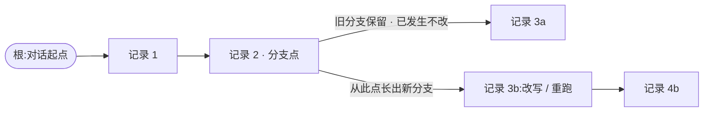

# Chapter 04 · 有状态 & 持久化

> 目标:让 agent 从"一次性运行"变成"能跨轮、跨崩溃可靠记住"的东西。核心是把历史做成一棵**只追加、可分支、fail-closed**的持久事实树。

前三天的 loop 每次跑完，记忆就没了。今天给它一个可靠的"记忆"——而"可靠"在这里有非常具体、反直觉的含义。

---

## 一、状态，是事件叠出来的(不是随手改的变量)

一个有状态 agent 的状态，最好由**事件归约(reduce)**得来:`AgentEvent → AgentState`，而不是到处 `state.x = y` 乱改。几条经验:

- **忽略过期事件**:上一轮运行的迟到事件，不能污染新一轮的状态(按 runId 甄别)。
- **引用隔离**:给订阅者的状态/事件是**副本**，别把内核的可变引用漏出去——否则订阅者一改，内核就被腐蚀。
- **abort 优先**:取消要排在事件队列之前处理。

> 这些是"内存态"的规矩;本章的 lab 聚焦更硬核、更可测的**持久态**——因为一旦要"跨崩溃记住"，规矩会严苛得多。

## 二、历史是一棵树，不是一条线

把对话历史做成**树**:每条记录带 `parentId`。为什么是树不是线?因为 agent 常要**从某个点重跑/改写**——那不是覆盖旧历史，而是从那点**长出一条新分支**。

- 旧分支还在(**已发生的事实不改不删**);
- 当前对话 = 从根到某个叶子的一条路径(`pathTo`)。



**"已发生的事实不可抹除"** 是贯穿的原则:下一轮模型即使报错，也不能倒回去抹掉上一轮已经完成的工具结果。事实只追加。

## 三、fail-closed 持久化:JSONL 的三条硬规矩

把树落成磁盘上的 **JSONL**(每行一个 JSON 记录，只追加)。可靠性靠三条**反直觉**的规矩:

**① 换行 = 提交标记。** 一条记录只有以 `\n` 结尾才算"已提交事实"。恢复时，如果最后一行**没有换行**，说明进程在写一半时崩了——**当它不存在**。宁可丢掉这半条，也不认损坏数据。

**② tainted writer。** 一次 append 写到一半失败后，这个 writer **永久拒绝再写**。绝不往一个可能损坏的日志后面继续追加。

**③ 只追加、不修改。** 永远不回头改已写的行。要"改"，就追加新记录(呼应第二节的分支)。

这就是 **fail-closed**:遇到任何不确定，选择"拒绝/丢弃"，而不是"尽力恢复"。它和多数人默认的"容错=尽量抢救"直觉相反——但对"事实日志"来说，宁缺毋滥才对。

> 诚实边界:这套只保证**单实例内**的顺序和 fail-closed;跨进程锁、`fsync`、自动修复、compaction 都**不在本章**(真实系统要另做)。

---

## 四、延伸:从"历史日志"到"记忆"(2026 的记忆分层)

本章建的是**可靠的记录底座**(只追加、可分支、fail-closed 的事实树)。但 2026 说的 agent"记忆",是**建在这种记录之上的一整层架构**,且被明确当作**独立于上下文窗口**的组件——别把两者混为一谈。常见分三层:

- **工作记忆 = 当前上下文窗口**:这一轮放得下的东西(对话、加载的文件、本次的工具结果)。**有界**——这正是 Day 5 的主题。
- **长期记忆 = 跨会话持久、按需检索的事实**:用户画像、世界事实、偏好。不是全塞进上下文,而是**用到时检索相关片段**。
- **经验记忆 = 过往轨迹 + 提炼出的策略**:让 agent 跨会话"越用越会"。

从"完整记录(无界)"到"上下文(有界)",工业界有两条桥:

- **compaction / 摘要**:历史超长时把旧轮次压成摘要(本章明说不做,**Day 5 展开**)。
- **检索式记忆 / memory 工具**:把事实写进外部存储(向量库 / memory 文件),需要时检索回来。前沿做法是让 agent 用一个 `memory` 工具**自己读写**长期记忆——MemGPT / Letta 的 **memory blocks**(把上下文切成独立可持久的块,agent 自编辑,如经典的"用户"块 + "人设"块),以及 Anthropic 的 **memory 工具**(文件式、跨会话增删改查,配合上下文编辑在一次 100 轮评测里**省了约 84% token**;具体接口以官方文档为准)。

> **判断力**:本章的 append-only 事实树是**底座**(可靠、可分支、fail-closed);记忆策略(压缩 / 检索 / 自编辑)是**建在其上的一层**。两层的目标不同——**事实层要 fail-closed、铁面不丢**;**记忆层负责"放进有限上下文的,是不是对的东西"**(接 Day 5)。反过来还有个反直觉点:正因为前沿让 agent **自己改记忆**,底下越需要一个像本章这样**只追加、可恢复**的可靠存储兜底——不然它把记忆改坏了就没得救。

## 五、你要建的(练习)

打开 `session.ts`，实现 3 样:

| Lab | | 关键 |
|-----|--|------|
| 4.1 | `recover` | JSONL → Entry[];**丢弃结尾没换行的残留**(换行=提交) |
| 4.2 | `pathTo` | 从树里取"根→某叶子"的活动路径;断链/未知 id 报错 |
| 4.3 | `SessionLog` | 只追加;写失败即 **tainted**、从此拒绝再写 |

```bash
npm run test:04   # 8 个测试(写入器用可注入的 write,确定性地测 fail-closed)
```

从 `recover` 起，让红色牵着走。卡住按 `定位→签名→伪代码→局部` 找 tutor。

---

## 六、收尾

- **讲回来**([`JOURNAL.md`](../../JOURNAL.md)):为什么"结尾没换行的行"要丢弃而不是尽力解析?为什么 writer 一旦失败就永久拒写?为什么历史要做成树、而不是覆盖?本章的"事实底座"和 2026 的"记忆层"(工作 / 长期 / 经验)各负责什么、为什么不能混?
- **迁移题**:见 [`TRANSFER.md`](./TRANSFER.md)——落到真实 fs、状态 reducer + 订阅者引用隔离、abort/steering、重复 id 的歧义。
- **真检验**:写一段日志→中途"崩溃"(最后一行不带换行)→ recover，确认崩溃的半条被正确丢弃、之前的事实完好。
