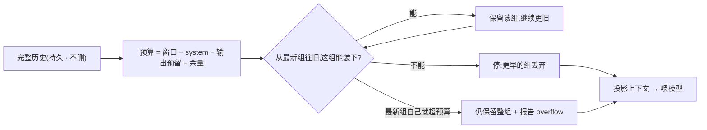

# Chapter 05 · 上下文管理

> 目标:让长时运行的 agent 不撑爆有限的上下文窗口。核心是**按语义组、有预算地投影**历史，再加 compaction / context editing 两招。

Day 4 让 agent 能可靠地"记住一切"。但"记住一切"会撞上 Day 0 讲过的硬墙:**上下文窗口有限**。一段长对话迟早塞不下——今天学怎么"花着用"这份预算。

---

## 一、为什么不能"全history 塞进去"

每次请求发给模型的 = system + 全部历史 + 留给输出的空间，全都算 token，都挤在**同一个有限窗口**里。历史无限增长，迟早溢出。所以你需要一个**投影(projection)**:把完整历史(Day 4 的持久事实，一条不丢)投影成一份"塞得进预算"的子集喂给模型。

**关键区分:完整历史(持久、不删)vs 投影给模型的上下文(有损、可重算)。** 你压缩的是"喂给模型的那份"，不是磁盘上的事实。

## 二、按语义组切，别按下标切(本章命门)

投影要丢弃一些旧内容。**怎么丢**是命门:

- ❌ **按数组下标切一刀**:很可能切出"有 tool 调用、没 tool 结果"的**半组**——模型看到一个悬空调用，直接懵。
- ✅ **按语义组切**:一次交互(`user` + 它引发的 `assistant-tools` / `tool-result` / `assistant-final`)是一个**原子组**，要留整组、要丢整组。

`groupInteractions`(Lab 5.1)就是把线性历史切成这种原子组。

## 三、有预算地投影(从新往旧)

`projectWithinBudget`(Lab 5.2):

- 预算 = 窗口总量 **先扣掉** system prompt、输出预留、安全余量后，**留给历史**的那部分。
- 从**最新**的组往前累加，装得下就留，装不下就停——更早的组丢弃(最近的上下文最相关)。
- 边界:**最新那一组自己就超预算**怎么办?**仍保留整组**，并**如实报告 overflow**——因为半组(有调用没结果)比"整组略超"更糟。
- `estimateTokens` 由调用者提供，且必须是**确定性纯函数**(否则投影不可复现)。



## 四、两招真实手段:compaction 与 context editing

投影是"选择性丢弃";工程上还有两招(概念，真实里常一起用):

- **compaction(压缩)**:把丢弃的旧组**总结成一段摘要**，作为**一条新事实追加**进 session(呼应 Day 4:追加不删除)。恢复时读最新摘要 + 后面的后缀。注意:摘要是新增，不是删旧。
- **context editing(上下文编辑)**:直接**清理**掉陈旧的 tool 结果 / thinking 块(不总结，直接删出投影)。比压缩更轻，适合"旧工具输出已无关"的情况。

> 边界:自动 summarizer、tokenizer 精度、跨 schema 兼容都不在本章;`estimateTokens` 由你给且要确定性。

---

## 五、上下文不只是"装得下",还要"别烂掉"(context rot)

前面把上下文当**容量**问题:装不装得进预算。但 2026 有个更反直觉、也更要命的发现——**即使远没装满,上下文越长、模型反而越差**。Chroma 2025 的《Context Rot》测了 18 个前沿模型:准确率随输入变长**非均匀下滑**,常在**远低于窗口上限**处就掉——一个 200K 窗口的模型,可能在 50K 就明显退化,掉幅 30–50%。三个叠加机制:

- **lost in the middle(中间迷失)**:模型对上下文的**开头和结尾**注意力好、**中间**差——关键信息埋在中段,可能被直接略过(单这一项就 30%+ 掉幅)。
- **注意力稀释**:注意力是平方级的,token 越多,真正相关的信号被越多无关内容稀释。
- **干扰项**:语义相近但无关的内容会把模型带偏。

**这把"投影"的意义整个抬高了**:你激进丢弃旧组,不只因为"会溢出"(容量),更因为**留太多本身就拉低质量**(哪怕装得下)。经验尺度:有效安全上限常在**标注窗口的 1/4 ~ 1/10**——200K 窗口通常到 40–80K 就该警惕,别看着"还没满"就使劲往里堆。

> **2026 的名字:context engineering(上下文工程)。** prompt engineering 是"把一次问话写好";context engineering 是"每一步该把**哪些** token 放进有限上下文"——检索、投影、compaction、context editing 都是它的手段。圈内流传一句话:**多数 agent 失败,本质是上下文失败**(放错了 / 放太多 / 放过期的),不是模型不行。你这章手写的 `projectWithinBudget` 就是 context engineering 最核心的一块肌肉。

**判断力**:别把"模型窗口有 200K / 1M"当成"我能塞 200K / 1M"。窗口是**物理上限**,**有效上限低得多**;能少放就少放,把最相关的放在**首尾**而非中间。

## 六、你要建的(练习)

打开 `context.ts`:

| Lab | | 关键 |
|-----|--|------|
| 5.1 | `groupInteractions` | 按 `user` 切成原子交互组 |
| 5.2 | `projectWithinBudget` | 从新往旧留**整组**;最新组超预算 → 保留整组 + overflow |

```bash
npm run test:05   # 5 个测试:分组 / 预算够 / 只够最新组 / 绝不切半组 / 最新组超预算
```

从 `groupInteractions` 起，让红色牵着走。卡住按 `定位→签名→伪代码→局部` 找 tutor。

---

## 七、收尾

- **讲回来**([`JOURNAL.md`](../../JOURNAL.md)):为什么按语义组切、而不按数组下标?"最新组超预算就保留整组"背后的取舍是什么?compaction 为什么是"追加摘要"而不是"删旧历史"?为什么"装得下"还不够——context rot 是什么、它怎么把"投影"从容量问题变成质量问题?
- **迁移题**:见 [`TRANSFER.md`](./TRANSFER.md)——把投影接到 Day 2 发请求前、compaction 追加进 Day 4 的 session、反序完成的 tool 结果如何仍按组切。
- **真检验**:造一段超长历史，投影到小预算，确认 kept 里**没有任何悬空的 tool 调用**(半组)。
