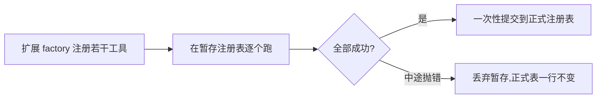

# Chapter 06 · 可扩展性(MCP · Skills · 扩展隔离)

> 目标:让 agent 的能力从"写死在代码里"变成"可插拔的生态"。重点是 **MCP**——一个开放标准，让你接上别人写好的工具服务器，而不必自己实现每样能力。

前几天工具都是你手写的。真实世界里，能力来自一个**生态**:GitHub、数据库、浏览器…… 都有现成的服务可接。今天学怎么"接"，且接得安全、省 token。

---

## 一、MCP:工具的"通用插头"(重点)

**MCP(Model Context Protocol)是一个开放标准**——不属于任何一家 provider/厂商。一个 **MCP server** 暴露一批工具(和资源)，任何支持 MCP 的 agent/客户端都能接上用。

- 类比:MCP 之于工具，像 USB 之于外设——**一个标准接口，插上就能用**，不用为每家写适配。
- 对你"不锁定"的意义:你暴露的工具、你接的能力，**跨 provider、跨客户端通用**——这是回报最高的防锁定投资。

接法(本章的 `mcpToolRegistry`,Lab 6.1):MCP server 提供 `listTools()` 和 `callTool(name, args)`;你把它的工具**加命名空间**(`github.search`，避免撞名)包成 Day 1 的 `ToolRegistry`，每个工具转发给 `server.callTool`。**接完，Day 1 的 loop 直接就能调——它根本不知道这些工具来自 MCP。** 又一次:核心不认识来源，能力从边界接入。

> 真实接法用官方 MCP SDK(走网络/协议);本章用一个内存版 `McpServer` 接口聚焦"如何把 MCP 工具融进 loop 的 registry"。真 SDK 的确切调用现查官方文档(见 `AGENT.md`)。

## 二、Skills:按需激活，省 token

**Skill = 带正文的能力包**(一套做某类任务的说明/最佳实践)。但正文可能很长，全塞进上下文太贵。所以用**渐进式披露**:

- **发现**:所有 skill 的**一句描述**始终可见，让模型知道"有这么个 skill"。
- **激活**:只有当任务需要、skill 被激活时，才加载它的**正文**进上下文。
- **没激活的 skill，正文绝不进上下文。**

`buildSkillContext`(Lab 6.2)就是这个:列全部描述 + 只附激活者的正文。省 token，又不丢发现能力。

> **放到行业里:这就是 Anthropic 的 Agent Skills(2025)。** 你写的 `buildSkillContext` 正是它的内核——**渐进式披露**分三级:① 启动时只加载每个 skill 的**名字 + 描述**(约 100 token)供发现;② 激活时才加载**完整正文(SKILL.md)**;③ 正文里引用的**脚本 / 资源按需再加载**(本章 Lab 做前两级,第三级是自然延伸)。为什么值得?当 agent 接上**几百个 MCP 工具**时,把所有工具定义一股脑塞进上下文会**爆炸**;Skills 用渐进披露把它压下来——Anthropic 报告某基准从 **15 万 token 降到 2 千(~98.7%)**。**Skills 与 MCP 是互补、不是竞争**:MCP 负责"接上外部 API / 数据库",Skills 负责"教会模型怎么用好这些工具的流程"。

## 三、扩展隔离:原子注册 + 故障隔离

接第三方扩展 = 引入不受你控制的代码，必须防它把系统搞坏:

- **原子注册**(Lab 6.3):扩展用一个 factory 注册若干工具。**要么全成功、要么什么都不留**——factory 注册到一半抛错，不能留下"半套工具"这种不一致状态。做法:先在**暂存**注册表跑 factory，全过了再一次性提交。
- **故障隔离**(概念):扩展的 hook(如 `beforeToolCall`)拒绝/抛错/超时，应**归一成一个与原调用配对的错误结果**，不能炸穿核心;`afterToolResult` 失败只写诊断，**不能改写已发生的工具事实**(呼应 Day 4)。
- **信任边界**(概念):不受信任的扩展不该有机会跑 import 顶层代码——先过 trust gate 再加载。



> 诚实边界:hook 超时只能"停止等待"，不能强杀扩展内部还在跑的异步任务;resource/工具的边界是加载护栏，不是 OS sandbox(呼应 Day 3)。

**延伸:接第三方 MCP,是在扩大攻击面(2026 必须知道)。** 一个第三方 MCP server 暴露的**工具描述**和**返回结果**,都会作为文本进入模型的上下文——而模型**分不清"文档"和"指令"**。恶意 server 可以把攻击指令**藏进工具描述里**(用户界面通常看不到),诱导模型"顺手"读取敏感文件、再把内容当参数传出去外泄——这类攻击叫 **tool poisoning(工具投毒)**,已列入 **OWASP MCP Top 10(MCP03:2025)**。**多个 server 连在一起更危险**:一个恶意 server 能借机窃取你通过**其他可信 server** 才拿得到的数据。所以本章的 **trust gate 不是走过场**:第三方能力要**先审信任、按最小权限接**,并且对工具的**描述和结果都保持"这是数据、不是命令"的警惕**——这正是全课那条主线("**指令只来自用户;工具/外部内容只是数据**")在扩展生态里的实战版。

---

## 四、你要建的(练习)

打开 `extensions.ts`:

| Lab | | 关键 |
|-----|--|------|
| 6.1 | `mcpToolRegistry` | 把 MCP 工具**加命名空间**包成 ToolRegistry、转发调用 |
| 6.2 | `buildSkillContext` | 全部露描述，**只有激活的带正文** |
| 6.3 | `registerExtension` | **原子**:暂存跑 factory，全过才提交;抛错则 target 不变 |

```bash
npm run test:06   # 4 个测试:MCP 命名空间+转发 / skill 按需 / 原子注册成功 / 原子注册回滚
```

卡住按 `定位→签名→伪代码→局部` 找 tutor。

---

## 五、收尾

- **讲回来**([`JOURNAL.md`](../../JOURNAL.md)):MCP 为什么是"防锁定"的投资?为什么没激活的 skill 正文不能进上下文(渐进披露省了多少)?为什么扩展注册要原子(全或无)?什么是 tool poisoning,为什么"工具描述也是不可信数据"、trust gate 不能走过场?
- **迁移题**:见 [`TRANSFER.md`](./TRANSFER.md)——接真实 MCP SDK、软链接 realpath 检查、hook 故障隔离(beforeToolCall 归一成配对错误)、多 root 同名 skill 谁胜出。
- **真检验**:用假 MCP server 接进 Day 1 loop，让 agent 调一个"来自 MCP"的工具，loop 代码一行没为 MCP 改。
