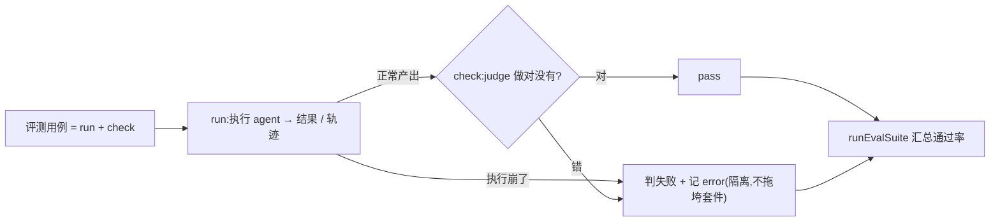

# Chapter 10 · Evals & 可观测

> 目标:回答"我这个 agent 到底做得对不对、跑成什么样"。建评测(判定任务成没成)+ 可观测(记录它走了哪几步)。这是 2026 主流栈里独立成"竖轨"的能力，也是 agent 从"能跑"到"可信、可迭代"的关键。

前面把 agent 建得很能干。但 agent 是**非确定**的、会走弯路——**"没报错"不代表"做对了"**。今天学怎么**度量**它。

---

## 一、为什么 eval 是一等公民(而不是事后补)

- 改一句 prompt、换一个模型、加一个工具——agent 行为可能**悄悄变差**，而且不报错。
- 没有评测，你就是在"凭感觉"改;有评测，你才能**回归验证**、放心迭代。
- 2026 的共识:eval 和可观测是**和功能同等重要**的两条竖轨，不是上线后才想。
- **一个扎心的裂口**(LangChain《State of Agent Engineering》调研):**89% 的团队上了可观测,却只有 52% 有 eval**——质量就死在这 37 分的差里(能看到 agent 干了啥,却没有"它干得对不对"的度量)。
- **工业界的落法是"三层"**:① 每次改动 / PR 的**快检**(确定性断言,秒级)② 每晚**回归套件**(评一批 golden 用例的通过率,开放题用 LLM-as-judge)③ 线上**漂移监控**(采样真实流量、质量掉了报警)。本章建 ①②(`runEvalCase` / `runEvalSuite`),③ 就是把同一套判定接到线上流量。

## 二、trajectory eval:评轨迹，不只评答案

朴素做法:只看**最终答案**对不对。但 agent 的问题常藏在**过程**里:

- 它是不是**该查资料却没查**，靠瞎编蒙对了答案?(这次对，下次就错)
- 它是不是**绕了一大圈**、调了一堆没用的工具才到终点?

**trajectory eval** = 评的是**整条轨迹**:用了对的工具吗?步骤合理吗?到达目标了吗?所以 `check` 要能看到**整个 run 的过程(history/trace)**，而不只是最后那句话(Lab 10.2 的 trajectory 测试就体现这点)。

## 三、判定与执行分离，失败要隔离

一个评测用例 = **怎么跑(run)** + **怎么判(check)**，两者分开:

- `run`:执行 agent，产出结果(可以是最终答案，也可以是整条轨迹)。
- `check`:judge，判断任务做对没有。
- `runEvalCase`:稳稳地把两者串起来——**执行崩了 = 这个 case 判失败并记下 error，而不是让整个套件崩掉**。失败必须被隔离(一个坏 case 不能拖垮回归套件)。

`runEvalSuite`:跑一批(**回归套件**)，汇总**通过率**——这就是你改代码后"有没有变差"的度量。



## 四、怎么"判":确定性检查 vs LLM-as-judge(2026 的深水区)

§3 把 run 和 check 分开了。但真正难、也最被低估的,是 **check 里到底怎么判对错**。两条路,克制地选:

**确定性检查(能用就优先)**:精确匹配、正则、JSON schema 校验、数值容差,以及**轨迹断言**(有没有调该调的工具、步数是否合理)。快、免费、可复现、零偏差。**凡是能确定性判的,绝不用 LLM**——和本课一贯的克制一脉相承。

**LLM-as-judge(只有开放式输出才用)**:总结得好不好、回答有没有帮助、轨迹合不合理——这些无法精确匹配,只能让**另一个 LLM 打分**。2026 它已从"小技巧"长成一门方法学。但要清醒:**这是在用一个不可靠的东西去判另一个不可靠的东西**,不校准就是自欺。它自带系统性偏差:

- **位置偏差**:成对比较偏向排前 / 排后的那个 → 两种顺序各判一次,不一致就存疑。
- **啰嗦偏差**:偏向更长的答案 → rubric 里明说"简洁也可满分"。
- **自我偏好**:偏向与自己风格相近的输出 → 换一个模型家族当 judge。
- **不稳定**:同一输入给不同分 → 低温 + **结构化打分**(分数 + 打分理由)+ 多次取多数。

让 LLM judge 可信的三件事:

1. **写 rubric**:给明确评分标准(1–5 各代表什么),别只问"好不好"。
2. **用 golden set 校准**:先拿一小批**人工标注**的用例让 judge 去判,**judge 与人标对齐了,才敢拿它批量跑**。judge 没校准,后面所有通过率都是幻觉。
3. **优先参考引导 / 成对**:给一个参考答案让它对比,比"凭空打分"稳得多。

> **一句判断力**:判定方法本身也要被评测。你的 `check` 靠不靠谱,拿人工标注一对就知道——**别用没校准的 judge 得出的通过率骗自己**。(呼应 §1 那 37 分裂口:很多团队"有 eval"其实是"有个没校准的 judge"。)

## 五、可观测:把每一步记下来

光有通过率不够，还要能 **debug** 和**看成本**。`Tracer`(Lab 10.1)记录每一步 span(哪次 model 调用、哪个工具、耗时多少、花了多少 token)，再汇总。真实系统里这叫 **tracing/observability**，是排查"为什么这次跑砸了""钱花哪了"的眼睛。

> 边界:真实 trace 有父子时间线、分布式追踪、drift 检测、线上/线下评测……本章建"结构化记录 + 判定分离 + 通过率"这个内核;工业级观测平台是专门领域。

---

## 六、你要建的(练习)

打开 `eval.ts`:

| Lab | | 关键 |
|-----|--|------|
| 10.1 | `Tracer` | 记录 span、汇总 count/tokens/ms |
| 10.2 | `runEvalCase` | 执行+判定分离;**执行崩=记为 fail 不抛出**;check 可评整条轨迹 |
| 10.3 | `runEvalSuite` | 跑回归套件、汇总通过率、失败隔离 |

```bash
npm run test:10   # 6 个:trace 汇总 / pass / fail / 执行崩=fail / trajectory / 套件通过率
```

卡住按 `定位→签名→伪代码→局部` 找 tutor。

---

## 七、收尾

- **讲回来**([`JOURNAL.md`](../../JOURNAL.md)):为什么"没报错"不等于"做对了"?trajectory eval 比只看最终答案强在哪(举个"答案对但过程错"的例子)?为什么执行崩要记为 fail 而不是让套件抛出?什么时候该用确定性检查、什么时候才动用 LLM-as-judge?LLM judge 有哪些系统偏差,为什么批量跑前必须先拿人工标注校准?
- **迁移题**:见 [`TRANSFER.md`](./TRANSFER.md)——把 Tracer 接进 Day 1 loop(记录每步 model/tool)、用 LLM 当 judge、给你的 coding agent 建一个回归套件、每个 case 重新 prepare 隔离环境。
- **真检验**:给一个"答案文本正确、但没调该调的工具"的假运行，写一个 trajectory `check` 把它判为 fail——证明你评的是过程不是表象。
