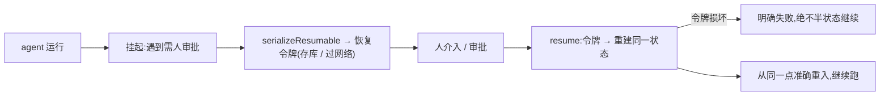

# Chapter 11 · 上生产(LLMOps & 服务化)

> 目标:把 agent 从"本地能跑"推到"生产站得住"——服务化、可恢复、上线门禁、主动优化。这是 agent 从 demo 到产品的最后一公里，也是很多教程直接跳过、却决定成败的一层。

前十天你建出了一个能干活的 agent。但"能在你终端跑"和"能在真实网络+用户操作下稳定服务"之间，隔着一整层工程。今天补上。

---

## 一、服务化:agent 是个服务，不是个脚本

生产里 agent 要暴露成**服务**(HTTP/SSE 端点)，被前端/其他系统调用。两个关键考量:

- **部署基座**:
  - **Serverless / Edge**:按需拉起、无状态、有执行时长上限——适合短交互，但长任务/长轮询会撞墙。
  - **长运行容器**:常驻进程，适合长任务、有状态守护——但要自己管生命周期、扩缩容。
  - 选哪个取决于你的 agent 是"一问一答"还是"跑很久"。
- **有状态 vs 无状态**:无状态好扩容，但 agent 的 session(Day 4)/上下文得外置(DB);有状态省事但难扩。

> 真实部署到具体平台(Vercel/AWS/Cloudflare…)现查平台文档(见 `AGENT.md`)。本章聚焦**可迁移的服务化内核**。

> **放到行业里:agent 之间也在标准化——A2A(Agent2Agent)。** Day 6 的 MCP 是"agent ↔ 工具";而当你的 agent 变成一个**服务**、要跟**别人的 agent**(跨框架、跨公司)协作时,2025 年 4 月 Google 开放的 **A2A** 就是那层协议——走 HTTP/JSON-RPC,用 "Agent Card" 互相发现能力,现由 Linux 基金会治理、150+ 组织(微软 / AWS / Salesforce / SAP 等)支持。一句话记牢:**MCP 连工具,A2A 连 agent。**

## 二、流式响应与 Generative UI(概念)

前端要**实时**看到 agent 的进展:把 Day 2 的事件流，通过 **SSE**(Server-Sent Events)推给浏览器。前端框架(如 Vercel AI SDK 的 `streamUI`)能把这些事件渲染成**动态组件**(Generative UI)——模型不只吐文字，还能"下发"一个卡片/表单。

- 可迁移的核心你已有:Day 2 的 `accumulate`(碎片→事件)。服务端把这些事件按 SSE 逐条 flush，前端消费即可。
- 前端组件渲染是**框架强耦合**的，不在本课核心(守 provider/框架中立);会用 Day 2 的事件流 + SSE，你就能接任何前端。

## 三、suspend / resume:HITL 的端到端(本章硬核)

Day 9 的"人在环路"、Day 7 的"可暂停"——在**服务化**下有个硬要求:后端状态机挂起时，状态必须能**序列化跨线**(过网络、存库)，人介入后能从**同一状态准确重入**。

- 无状态服务尤其如此:请求结束进程就没了，"等人审批"这段必须把状态**存下来**，审批回调时**重建**。
- `serializeResumable`/`resume`(Lab 11.2)就是这个内核:挂起态 ↔ 恢复令牌;令牌损坏要**明确失败**，绝不拿半个状态继续(呼应 Day 4 fail-closed)。

> **放到行业里:这套"挂起态可序列化、事后精确重入"就叫 durable execution(持久化执行)。** 生产级工作流引擎(如 Temporal / Inngest、以及 LangGraph 的持久化 checkpoint)提供的正是它:让一段可能跑很久、中途要等人或等外部事件的流程,**跨进程崩溃与重启都能从断点续跑**。你手写的 `serializeResumable`/`resume` 就是这个内核——理解它,再看那些引擎在替你做什么就一目了然(又一次:先从零建,再看框架)。



## 四、上线门禁:CI gate(把 Day 10 用起来)

Day 10 建了回归套件，但"跑一下看看"不叫工程。生产实践是把它接成 **CI 门禁**:每次改 prompt/模型/工具，流水线自动跑评测，**劣化就挡在门外**。

`evalGate`(Lab 11.3):两条红线——**任何基线通过的 case 出现回归 → 挡下**;**通过率低于下限 → 挡下**。我们仓库已有 GitHub Actions，把它接上，坏配置就进不了 main。

## 五、主动优化:语义缓存

Day 5/9 是**被动**底线(别超预算/别跑飞)。生产还要**主动**降延迟省钱。最有效的一招:**语义缓存**——高频业务里，语义相近的请求直接返缓存，不再打模型。

`SemanticCache`(Lab 11.1):复用 Day 8 的相似度——查询向量与缓存项相似度 ≥ 阈值就命中。为什么"语义"而非精确 key?自然语言问法千变万化，精确匹配几乎不命中，语义近似才有复用价值。

> **放到行业里:先开 prompt caching,它是回报最高的第一刀。** 语义缓存是**你在应用层**跳过整次模型调用;而 **prompt caching** 是**在 provider 层**复用请求里重复的**前缀**(system prompt、工具定义、RAG 上下文这些每次都一样的大块)。命中的缓存读**便宜约 90%**(如 Anthropic 把输入从 \$3/M 降到 \$0.30/M)、延迟也大降;三大家都支持,接入从"零改动"(OpenAI 自动)到"加一个字段"(Anthropic 的 `cache_control`)。凡是**反复带大段固定上下文**的 agent(工具定义、RAG 尤其如此),这是**单点回报最高的省钱手段**——有个被反复引用的例子:加三个缓存标记,月账从 \$720 降到 \$72。呼应 Day 2:这正是"私有能力藏在 adapter 接缝后"的典型——loop 不必知道,adapter 层按各家方式开缓存即可。

> 更深的 token 压缩/关键特征提取是研究方向;本课到语义缓存 + Day 5 compaction 为止。

## 六、并发状态冲突(补 Day 7)

Day 7 的 `parallel` 并发多分支后 `merge`。生产里若多个节点**并发写共享状态**，会有**数据竞争/写冲突**。约束思路:不可变更新(各分支产出增量，由 merge 统一合并，别就地改共享对象)、或对冲突键显式定义合并策略。见迁移题。

---

## 七、你要建的(练习)

打开 `prod.ts`:

| Lab | | 关键 |
|-----|--|------|
| 11.1 | `SemanticCache` | 相似度 ≥ 阈值即命中;多条取最相似 |
| 11.2 | `serializeResumable`/`resume` | 挂起态 ↔ 令牌;损坏令牌明确失败 |
| 11.3 | `evalGate` | 回归 或 通过率不达标 → 挡下，并说明原因 |

```bash
npm run test:11   # 8 个:缓存命中/miss/多条 · suspend往返/损坏 · 门禁放行/回归/低通过率
```

卡住按 `定位→签名→伪代码→局部` 找 tutor。

---

## 八、收尾

- **讲回来**([`JOURNAL.md`](../../JOURNAL.md)):无状态服务下，"等人审批"这段状态为什么必须序列化外置(这套为什么叫 durable execution)?语义缓存(应用层)和 prompt caching(provider 层)各省的是什么、为什么后者常是回报最高的第一刀?CI 门禁为什么要卡"回归"而不只看"通过率"?MCP 和 A2A 分别连什么?
- **迁移题**:见 [`TRANSFER.md`](./TRANSFER.md)——SSE 服务化把 loop 事件推给前端、部署到 Serverless、并发写冲突的合并策略、跨服务多 agent 协议(A2A)。
- **真检验**:把 Day 10 的 `evalGate` 接进仓库的 GitHub Actions，故意改坏一个配置，确认 CI 把它挡下。
