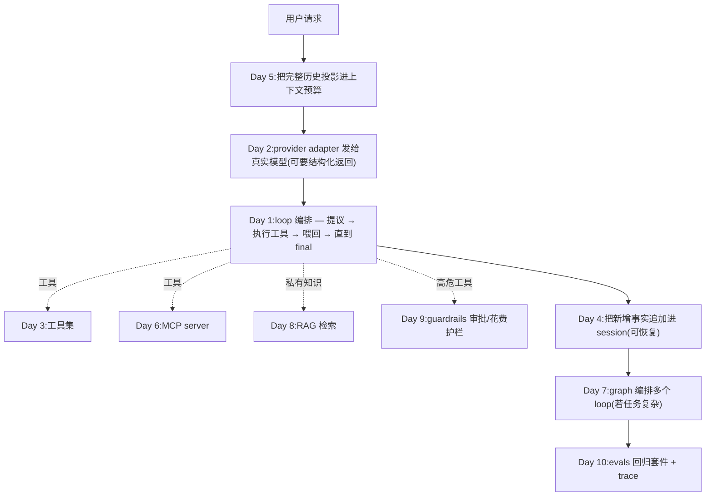

# Chapter 12 · Capstone 课程设计:独立做一个 agent 产品

> 目标:把前面各章的零件，组装成**你自己的一个 agent 功能产品**。这一章没有"填空题"——你来**设计、实现、自评**。做完它，你就具备了独立设计开发 agent 产品的能力。

前十天你从零建出了:loop(D1)、真实模型(D2)、工具集(D3)、有状态持久化(D4)、上下文管理(D5)、MCP 扩展(D6)、graph 编排(D7)、RAG 检索(D8)、Guardrails 护栏(D9)、Evals 评测(D10)。今天把它们**按需**拼成一个能解决真实问题的东西。

---

## 一、流程(四步)

1. **选题**:挑一个你真想要的 agent(见下面示例)。范围要小到"一天能做出雏形"。
2. **写一页设计**:用 [`DESIGN.template.md`](./DESIGN.template.md)。**动手前必须写**——这一步就是"独立设计"能力本身。
3. **实现**:用前面各章的零件搭起来(见第三节的组装指引)。
4. **自评**:用 [`SELF-EVAL.md`](./SELF-EVAL.md) 验收——"程序跑完 ≠ 任务做对"。

## 二、选题示例(挑一个，或自拟)

- **仓库问答/改码 agent**:回答"这个函数在哪调用"、或改一个小 bug 并跑测试(loop + 工具集)。
- **文档批处理 agent**:读一批文件，抽取结构化信息汇总(loop + 结构化返回 + 工具集)。
- **网页调研 agent**:给个题目，查资料、汇总成报告(loop + web 工具 / MCP)。
- **数据分析 agent**:读 CSV，回答问题、出结论(loop + bash/工具)。
- **带 MCP 的助理**:接一个 MCP server(GitHub/日历…)做真实操作(loop + MCP)。
- **多步调研+写作**:调研和写作分成两个子 agent(graph 编排)。

## 三、关键设计判断:用哪一格(raw/harness/loop/graph)

这是这门课要你带走的核心能力——**别无脑上最重的**:

| 你的任务是… | 用 |
|---|---|
| 一步能说清、结果可预测(翻译、抽字段、分类) | **raw / 结构化返回**(一次调用)，别 agent |
| 步骤固定写死 | **workflow**，别让模型决定步骤 |
| 开放、多步、要模型边做边判断 | **loop**(Day 1 + 工具) |
| 有显式分支 / 并行 / 多 agent / 需可暂停恢复 | **graph**(Day 7) |

在设计文档里**明确写出你选哪一格、为什么**——这比代码更能体现你的判断力。

> 生产视角(Day 11):也要想清**部署形态**(Serverless/Edge 短交互 vs 长运行容器)、**状态外置**、**语义缓存**是否需要——真实产品这些决定成败。

## 四、怎么把零件组装起来(参考)

一个典型装配(按需取用，不是全都要):

- **最小可用**:很多产品只需要 Day 1 loop + Day 3 工具 + Day 2 真实模型。**先把最小闭环跑通**，再按需加 4/5/6/7。
- 各零件你已在 journey 里实现过;capstone 就是把你自己的实现接起来。

## 五、交付物

1. 填好的 `DESIGN.local.md`(从模板复制)——一页设计。
2. 能跑的 agent(最小闭环起步)。
3. **生产健壮性验证(强制，回应真实交付)**:
   - 把 agent 暴露成一个**服务边界**(SSE 流式响应，Day 11);
   - 跑通一次 **suspend → 人工介入 → resume** 的端到端(Day 9 + Day 11);
   - 把回归套件接成 **CI 门禁**(Day 10 + Day 11 `evalGate`)，故意改坏一个配置确认被挡下。
4. 填好的 `SELF-EVAL.local.md`——自评报告。

> `*.local.md` 是你的私有作答(git 忽略);模板是公共的。

---

## 六、这一章"没有标准答案"是故意的

前十天有测试兜底(对/错分明)。capstone 没有——因为**真实产品就没有测试帮你判断"设计对不对"**，只能靠你自己的判断力。这正是这门课的终点检验:

> 你能不能说清"我为什么这样设计、为什么用/不用 graph、边界和风险在哪"——而不只是"它能跑"。

能讲清楚，你就是个能独立设计开发 agent 产品的工程师了，而不是一个只会点"接受"的人。这，就是"两周成为 Agent 专家"的意思。
